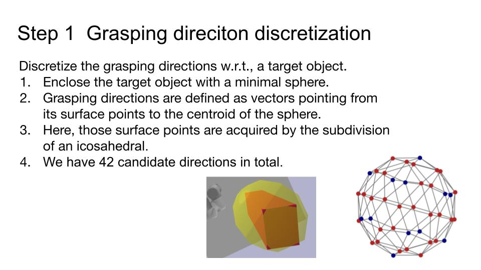

# DeepHeuristic
This project is split to multiple environments. In this fork of the project we initialized the Tiago environment (see folder [Tiago](https://github.com/ttianyuren/DeepHeuristic/tree/main/Tiago)). This environment has multiple scenarios
- the empty tabletop scenario called BuildWorldScenario in the module [build_world_learn_grasp.py](https://github.com/ttianyuren/DeepHeuristic/blob/main/Tiago/build_world_learn_grasp.py)
- the tabletop scenario with the big static object in the middle called BuildWorldScenarioStatic in the module [build_world_static.py](https://github.com/ttianyuren/DeepHeuristic/blob/main/Tiago/Environment/build_world_static.py)
- the tabletop scenario with the small table on top called BuildWorldScenarioTable in the module [build_world_top_table.py](https://github.com/ttianyuren/DeepHeuristic/blob/main/Tiago/Environment/build_world_top_table.py)

On the other hand there are the deep learning models that were trained differently and compared to get the best results in folder [deep_heuristic/models](https://github.com/ttianyuren/DeepHeuristic/tree/main/deep_heuristic/models). The folder [deep_heuristic](https://github.com/ttianyuren/DeepHeuristic/tree/main/deep_heuristic) also has the data generation tools, some utils, debug and visualisation tools.

To experiment with the models please navigate to [deep_heuristic/models](https://github.com/ttianyuren/DeepHeuristic/tree/main/deep_heuristic/models) and run the module [exp](https://github.com/ttianyuren/DeepHeuristic/blob/main/deep_heuristic/models/exp.py) after loading some data drom the [nn_utils](https://github.com/ttianyuren/DeepHeuristic/blob/main/deep_heuristic/nn_utils.py) module or a depth image of your choice.

## Use Sphere GNN to represent the surroundings of a target object

1. Draw a minimum sphere around the target object.
2. Sample points on the sphere by single-sphere [icosahedral discretization](https://arxiv.org/pdf/2103.10484.pdf).
3. Graph convolutions from a higher resolution grid to a lower.

## Deep heuristic for approachability prediction

